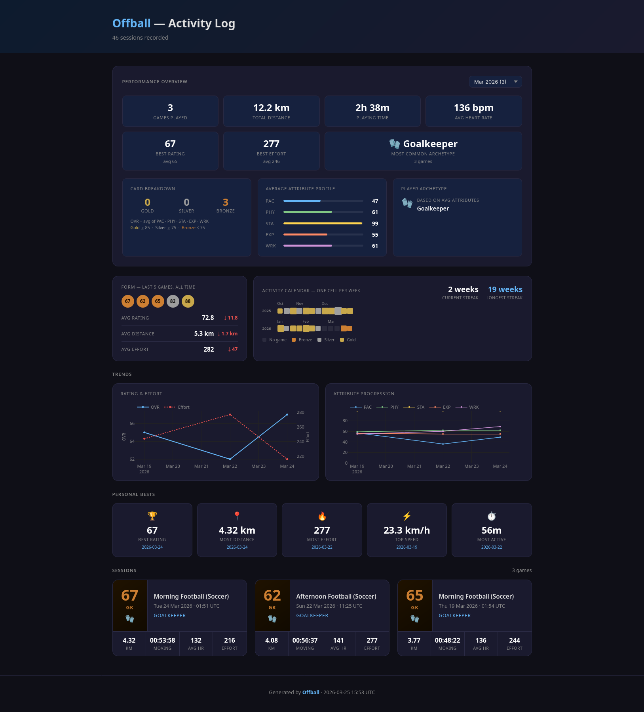
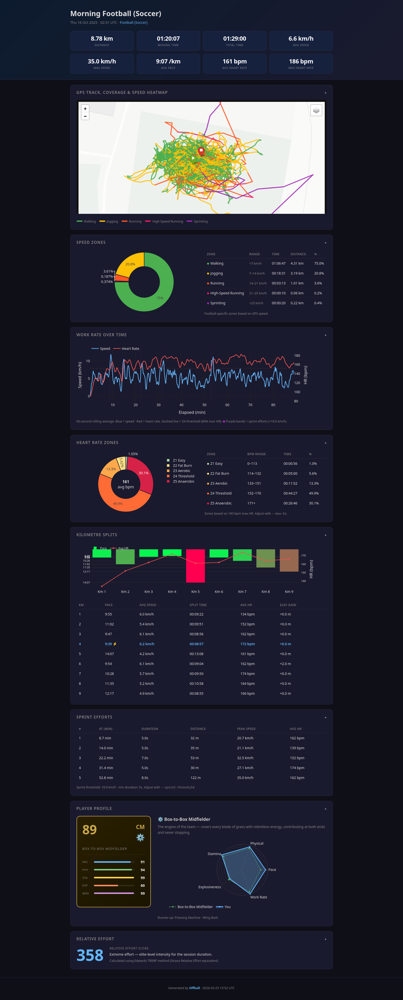

# Offball

The best players are dangerous even when they don't have the ball. This tries to measure that — all the running, pressing, and positioning that never shows up in a highlight reel but shows up very clearly in a GPS trace.

Drop your Strava GPX files in, run one command, get a breakdown of every session.

---

## What you get

The index page pulls everything together — session cards, your rating trend over time, how each attribute has moved, a form comparison of your last five sessions vs the five before, personal bests, and a weekly activity calendar. Worth looking at after a few months to see whether you're actually improving or just convinced you are.



Each session gets its own report. The usual stuff is there — distance, time, HR — but the more interesting bits are the speed zone breakdown, the work rate chart that shows your rolling speed and heart rate across the full game (good for spotting exactly when you ran out of gas), per-km splits, a sprint log, and a map with the route coloured by speed zone. You can also toggle on coverage and speed heatmaps to see where you spent most of your time.

There's also a player card. It scores you across five attributes — Pace, Physical, Stamina, Explosiveness, Work Rate — gives you an overall rating and a gold/silver/bronze finish, then matches you to the closest of 15 football archetypes. Some games you're a Box-to-Box Midfielder. Some you're a Sweeper. Depends on the day and honestly the data doesn't lie.



---

## Getting your Strava data

Strava lets you export everything. It takes a few minutes and arrives by email.

1. Go to **Settings → My Account → Download or Delete Your Account**
2. Hit **Request Your Archive**
3. Download and unzip — the `activities/` folder inside has all your GPX files
4. Copy the `.gpx` files into `data/`

Only football sessions get processed. Offball checks the `<type>` field on each GPX track and skips anything that isn't tagged `football` or `soccer` (Strava uses both). Runs, rides, swims — all ignored.

Heart rate from Garmin devices gets picked up automatically.

---

## Setup

Requires Python 3.10+.

```bash
python -m venv .venv
source .venv/bin/activate      # Windows: .venv\Scripts\activate
pip install -r requirements.txt
```

---

## Running it

Drop GPX files into `data/` (subfolders are fine), then:

```bash
python analyze.py
```

Reports land in `profile/`, the index at `index.html`. Open it in a browser — no server, just a file.

After the first full run, use `--new` so it only picks up sessions you haven't processed yet:

```bash
python analyze.py --new
```

It skips anything that already has a report in `profile/` and rebuilds the index from the `.json` sidecars next to each report. After a game, drop the new GPX in `data/` and run with `--new` — takes a few seconds.

### Options

| Flag | Default | What it does |
|------|---------|-------------|
| `--data-dir PATH` | `data` | Where to look for GPX files |
| `--new` | off | Skip sessions that already have a report |
| `--max-hr N` | `190` | Your actual max HR — zone boundaries are derived from this |
| `--sprint-threshold N` | `18.0` | km/h above which something counts as a sprint |
| `--smooth-window N` | `5` | Rolling median window in seconds for GPS noise |

If you know your real max HR, set it — the zone breakdown will be a lot more meaningful:

```bash
python analyze.py --max-hr 183 --sprint-threshold 20
```

---

## How the player card works

Five attributes get scored from your GPS and HR data:

- **Pace** — max speed, with a nudge up if you actually held it for a while rather than one lucky moment
- **Physical** — distance covered, weighted by how hard you were working throughout
- **Stamina** — whether your speed held up in the second half compared to the first
- **Explosiveness** — how often you sprinted and how big the gap was between your top speed and your average when moving
- **Work Rate** — time spent in the active speed zones

85+ overall is gold, 75+ is silver, below that is bronze.

Archetype matching just finds which of the 15 profiles your numbers sit closest to. No black box, just distance in five-dimensional space.
